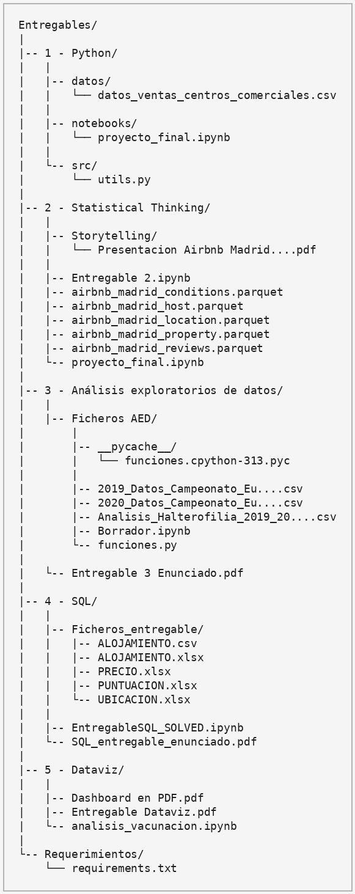

# 📊 Data Analytics – Entregables  
**Nuclio Digital School**

                                                                                             

## 📌 Descripción del repositorio
Este repositorio reúne los **trabajos evaluables del Máster en Data Analytics** cursado en **Nuclio Digital School**.  
Incluye ejercicios prácticos, notebooks, análisis y dashboards desarrollados a lo largo del programa, aplicando buenas prácticas de análisis de datos, programación y comunicación de insights.

El objetivo principal es demostrar competencias técnicas y analíticas en un entorno realista de trabajo con datos, cubriendo todo el ciclo analítico: **ingesta, transformación, exploración, modelado y visualización**.

---

# 🗂️ Estructura del repositorio

## 🧠 Módulos del máster

### 🐍 Python
Desarrollo de habilidades de programación aplicadas al análisis de datos:
- Manipulación de datos con librerías especializadas
- Estructuración de proyectos (scripts, notebooks y datasets)
- Limpieza, transformación y automatización de procesos analíticos

**Competencias demostradas:** pensamiento algorítmico, código limpio y reproducibilidad.

---

### 📈 Statistical Thinking
Aplicación de estadística descriptiva e inferencial a datasets reales (Airbnb Madrid):
- Exploración de variables y relaciones
- Generación y validación de hipótesis
- Storytelling basado en evidencia cuantitativa

**Competencias demostradas:** razonamiento estadístico y comunicación de insights.

---

### 🔎 Análisis Exploratorio de Datos (EDA)
Profundización en técnicas de exploración:
- Identificación de patrones, outliers y sesgos
- Feature understanding y data profiling
- Preparación del dataset para fases posteriores del análisis

**Competencias demostradas:** pensamiento crítico y comprensión del contexto de datos.

---

### 🗄️ SQL
Trabajo con bases de datos relacionales:
- Consultas complejas (JOINs, agregaciones, subqueries)
- Modelado y extracción de información
- Resolución de casos analíticos con SQL

**Competencias demostradas:** data wrangling en entornos estructurados y optimización de queries.

---

### 📊 Visualización de Datos (Dataviz)
Diseño y desarrollo de visualizaciones orientadas a negocio:
- Construcción de dashboards
- Selección de gráficos adecuados según objetivo analítico
- Storytelling visual y comunicación ejecutiva

**Competencias demostradas:** data storytelling, diseño de dashboards y enfoque business-driven.

---

## 🚀 Stack y herramientas
- Python
- Jupyter Notebook
- SQL
- Formatos Parquet
- Pandas, Nunpy y Matplotlib
- Looker Studio

---

